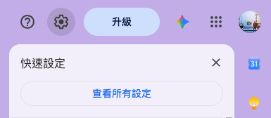
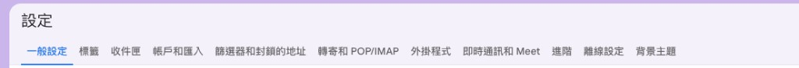
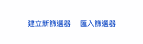
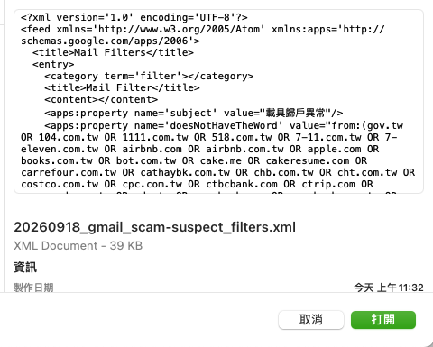
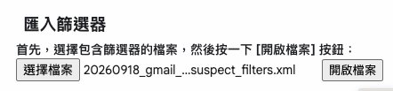
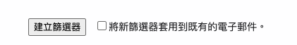

# Gmail 詐騙可疑信篩選器

## 為什麼我會做這個篩選器？

由於我發現近年來，詐騙集團除了使用簡訊、語音詐騙，也開始轉往 Email 釣魚詐騙。

因此我藉由收集常見詐騙集團會用的內容，並且可疑的寄件地址，讓大家的 Gmail 在收信時就可以自動略過收件匣，並標上 `scam-suspect`。

## 匯入前有幾件事情要注意：

1. **必須使用用電腦版 Gmail** ，因為手機 App 沒有匯入篩選器。
2. 我們會用到的檔案名稱為  [`mailFilters.xml`](mailFilters.xml)。
3. （建議）若過往您曾經使用過我的名單，需要先到「篩選器和封鎖的地址」把舊的篩選器刪掉
    1. 如果沒有做這件事，Gmail 匯入會重複建立已有的篩選器。

## 匯入步驟

### 1. 打開所有設定

Gmail 右上角齒輪 → 快速設定 → **查看所有設定**。

### 2. 切到篩選器分頁

設定頁上方選 **篩選器和封鎖的地址**。

### 3. 點匯入篩選器

分頁底部有 **建立新篩選器** 和 **匯入篩選器**。點 **匯入篩選器**。

### 4. 選 XML 檔

選 `mailFilters.xml`。用文字編輯器打開會看到 `<feed>` 和 `doesNotHaveTheWord`，那是正確格式。

選好後，頁面上會顯示檔名，再按 **開啟檔案**。

### 5. 建立篩選器

Gmail 會列出即將建立的規則，勾選後按 **建立篩選器**。

**將新篩選器套用到既有的電子郵件**：勾了會連信箱裡已經存在、符合條件的信一併略過收件匣並貼標。只想攔之後進來的信，就不要勾。

匯入後標籤 `scam-suspect` 若不存在，Gmail 會自動建立。

## 這份 XML 裡有什麼

### 詐騙常用到的詞語

例如：載具歸戶異常、發票中獎通知、稅務退稅通知、補繳關稅、交通違規逾期、誤設分期付款、止付驗證、金流驗證、已攔阻可疑登入。

## 排除了哪些網域？

分成兩個部分

1. **政府與學校**（來自 `govorgan.csv`，另補北市已改用的信箱網域）
- `gov.tw`：涵蓋 CSV 裡幾乎全部機關網站
- `edu.tw`、`sinica.edu.tw`
- `gov.taipei`：臺北市政府公務信已從 `taipei.gov.tw` 改過來，CSV 沒列

1. **常用平台官方寄信網域**
- 帳號與通訊：LINE、Google 官方、Apple、Microsoft 官方、Facebook／Instagram
- 購物、外送、旅遊：蝦皮、PChome、momo、博客來、露天、樂天市場、foodpanda、Uber／Uber Eats、Klook、KKday、易遊網、Trip.com（含舊網域 ctrip.com）、Airbnb
- 求職：104、1111、yes123、518、Cake（`cake.me`、`cakeresume.com`）
- 生活娛樂：秀泰（`showtimes.com.tw`）、威秀（`vscinemas.com.tw`）
- 電信：中華電信、台灣大哥大、遠傳
- 超商與物流：全家、7-11／ibon、萊爾富、OK、新竹物流、黑貓、高鐵
- 支付與日常消費：街口、全聯、家樂福、好市多、中油、台電、悠遊卡
- 銀行：台銀、土銀、一銀、華南、彰銀、兆豐、富邦、國泰世華、中信、玉山、台新、永豐、合庫、LINE Bank、樂天銀行、將來銀行

## 貢獻

歡迎 fork，改名單或補詐騙主旨後開 Pull Request。

`main` 有保護規則：不能直接 push，也不能自己把 PR 合進去。維護者 review 後才會合併。

建議改 `generate.py` 裡的 `SUBJECTS` 或 `PLATFORM_DOMAINS`，跑完把更新後的 `mailFilters.xml` 一併提交。
